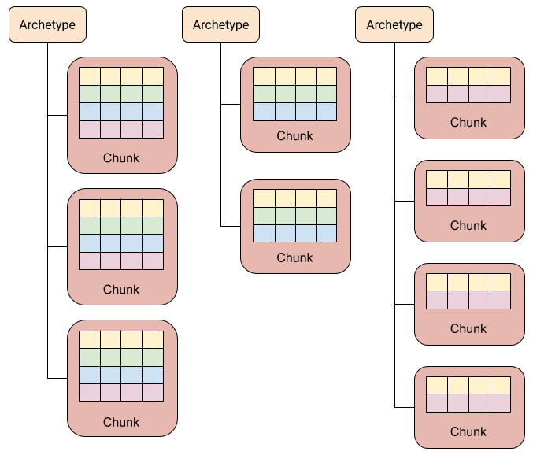

# [ECS concepts](https://docs.unity3d.com/Packages/com.unity.entities@0.11/manual/ecs_core.html)
实体组件系统（ECS）架构将身份（**entities**），数据（**components**）和行为（**systems**）分开。该架构专注于数据。系统读取组件数据流，然后将数据从输入状态转换为输出状态，然后对这些实体进行索引。

下图说明了这三个基本部分如何协同工作：  

在此图中，系统读取`Translation`和``Rotation``组件，将它们相乘，然后更新相应的`LocalToWorld`组件（`L2W = T * R`）。

实体A和B具有`Renderer`组件而C没有，但不影响系统，因为系统不关心`Renderer`组件。

您可以设置一个系统，使其需要`Renderer`组件，在这种情况下，系统将忽略实体C的组件。或者，您也可以设置系统以排除具有`Renderer`组件的实体，然后忽略实体A和B的组件组件。

## Archetypes
组件类型的独特组合称为**Archetype**。例如，一个3D对象可能具有用于其世界变换的组件，一个用于其线性运动的组件，一个用于旋转的组件以及一个用于其视觉表示的组件。这些3D对象之一的每个实例都对应一个实体，但是由于它们共享相同的组件集，因此ECS将它们归类为单个原型：  

在此图中，实体A和B共享原型M，而实体C具有原型N。

为了顺利更改实体的原型，可以在运行时添加或删除组件。例如，如果您从实体B中删除了`Renderer`组件，则它将移至原型N。

## Memory Chunks
实体的原型决定ECS在何处存储该实体的组件。 ECS以“块”分配内存，每个块均由一个[ArchetypeChunk](https://docs.unity3d.com/Packages/com.unity.entities@0.14/api/Unity.Entities.ArchetypeChunk.html)对象表示。块始终包含单个原型的实体。当内存块已满时，ECS会为使用相同原型创建的任何新实体分配新的内存块。如果添加或删除组件，然后更改了实体原型，则ECS会将该实体的组件移动到其他块中。  
  

这种组织架构提供了原型和块之间的一对多关系。这也意味着，找到具有给定组件集的所有实体只需要搜索现有的原型（通常数量很少），而不是所有实体（通常数量要大得多）。

ECS不会按照特定的顺序存储块中的实体。当实体被创建或更改为新的原型时，ECS会将其放入第一个存储该原型的块中，该块具有空间。然而，块仍然是紧密包装的；当实体从原型中移除时，ECS会将块中最后一个实体的组件移动到组件数组中新腾出的插槽中。

**注意**：原型中共享组件的值还决定了哪些实体存储在哪个块中。给定块中的所有实体对于任何共享组件都具有完全相同的值。如果更改共享组件中任何字段的值，则修改后的实体将移至其他块，就像更改该实体的原型时一样。如有必要，将分配一个新块。

当更有效地将它们一起处理时，可以使用共享组件对原型中的实体进行分组。例如，混合渲染器定义其[RenderMesh组件](https://docs.unity3d.com/Packages/com.unity.rendering.hybrid@latest?subfolder=/api/Unity.Rendering.RenderMesh.html)以实现此目的。

## Entity queries
要确定系统应处理的实体，请使用[EntityQuery](https://docs.unity3d.com/Packages/com.unity.entities@0.11/api/Unity.Entities.EntityQuery.html)。实体查询在现有原型中搜索具有与您的需求匹配的组件的原型。您可以通过查询指定以下组件要求：
* **All**-原型必须包含**All**类别中的所有组件类型。
* **Any**-原型必须包含**Any**类别中的至少一种组件类型。
* **None**-原型在**None**类别中不得包含任何组件类型。

实体查询提供了包含查询所需要的组件类型的块的列表。然后，您可以直接使用[IJobChunk](https://docs.unity3d.com/Packages/com.unity.entities@0.11/manual/chunk_iteration_job.html)遍历那些块中的组件。

## Jobs
要利用多个线程，可以使用[C＃Job system]。 ECS提供SystemBase类以及`Entities.ForEach`和`IJobChunk Schedule（）`和`ScheduleParallel（）`方法，以将数据转换到主线程之外。 `Entities.ForEach`是最简单的使用方法，通常只需较少的代码行即可实现。您可以将`IJobChunk`用于`Entities.ForEach`无法处理的更复杂的情况。

ECS按照安排系统的顺序在主线程上调度作业。在计划作业后，ECS会跟踪哪些作业读取和写入哪些组件。读取组件的作业取决于写入同一组件的任何先前的预定作业，反之亦然。作业调度程序使用作业依赖性来确定它可以并行运行哪些作业，哪些必须按顺序运行。

## System organization
ECS按[World](https://docs.unity3d.com/Packages/com.unity.entities@0.11/api/Unity.Entities.World.html)然后按group组织系统。默认情况下，ECS将使用一组预定义的组创建一个默认World。它找到所有可用的系统，实例化它们，并将它们添加到默认World中的预定义[模拟组](https://docs.unity3d.com/Packages/com.unity.entities@0.11/api/Unity.Entities.SimulationSystemGroup.html)中。

您可以指定同一组中系统的更新顺序。群组是一种系统，因此您可以像其他系统一样将群组添加到另一个群组并指定其顺序。组中的所有系统在下一个系统或组之前更新。如果未指定顺序，则ECS将以不依赖于创建顺序的确定性方式将系统插入更新顺序。换句话说，即使您未明确指定顺序，同一组系统也始终以其组内的相同顺序进行更新。实体组件缓冲系统

系统更新在主线程上进行。但是，系统可以使用作业将工作分流到其他线程。 SystemBase提供了创建和调度作业的直接方法。

有关系统创建，更新顺序以及可用于组织系统的属性的更多信息，请参阅[System Update Order](https://docs.unity3d.com/Packages/com.unity.entities@0.11/manual/system_update_order.html)上的文档。

## ECS authoring
在Unity编辑器中创建游戏或应用程序时，可以使用GameObjects和MonoBehaviours创建转换系统，以将这些UnityEngine对象和组件映射到实体。有关更多信息，请参见[创建游戏玩法](https://docs.unity3d.com/Packages/com.unity.entities@0.11/manual/gp_overview.html)。