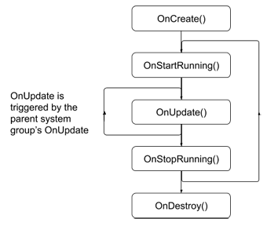

# Creating a system
实现抽象类[SystemBase](https://docs.unity3d.com/Packages/com.unity.entities@0.11/api/Unity.Entities.SystemBase.html)创建ECS系统。

要创建系统，请对必要的系统事件回调进行编程。 使用[SystemBase OnUpdate（）](https://docs.unity3d.com/Packages/com.unity.entities@0.11/api/Unity.Entities.SystemBase.html#Unity_Entities_SystemBase_OnUpdate_)函数执行系统必须在每一帧中完成的工作。 其他回调函数是可选的。 例如，您可以使用[OnCreate（）](https://docs.unity3d.com/Packages/com.unity.entities@0.11/api/Unity.Entities.ComponentSystemBase.html#Unity_Entities_ComponentSystemBase_OnCreate_)初始化系统，但并非每个系统都需要初始化代码。

系统回调函数按以下顺序调用：  

* [OnCreate()](https://docs.unity3d.com/Packages/com.unity.entities@0.11/api/Unity.Entities.ComponentSystemBase.html#Unity_Entities_ComponentSystemBase_OnCreate_) -- 创建系统时调用。
* [OnStartRunning()](https://docs.unity3d.com/Packages/com.unity.entities@0.11/api/Unity.Entities.ComponentSystemBase.html#Unity_Entities_ComponentSystemBase_OnStartRunning_) -- 在第一个[OnUpdate（）](https://docs.unity3d.com/Packages/com.unity.entities@0.11/api/Unity.Entities.SystemBase.html#Unity_Entities_SystemBase_OnUpdate_)之前以及每当系统恢复运行时。
* [OnUpdate()](https://docs.unity3d.com/Packages/com.unity.entities@0.11/api/Unity.Entities.SystemBase.html#Unity_Entities_SystemBase_OnUpdate_) -- 只要系统有工作要做，每个帧（请参见[ShouldRunSystem（）](https://docs.unity3d.com/Packages/com.unity.entities@0.11/api/Unity.Entities.ComponentSystemBase.html#Unity_Entities_ComponentSystemBase_ShouldRunSystem_)）并且系统已[Enabled](https://docs.unity3d.com/Packages/com.unity.entities@0.11/api/Unity.Entities.ComponentSystemBase.html#Unity_Entities_ComponentSystemBase_Enabled)。
* [OnStopRunning()](https://docs.unity3d.com/Packages/com.unity.entities@0.11/api/Unity.Entities.ComponentSystemBase.html#Unity_Entities_ComponentSystemBase_OnStopRunning_) -- 每当系统停止更新时，这可能是由于将[Enabled](https://docs.unity3d.com/Packages/com.unity.entities@0.11/api/Unity.Entities.ComponentSystemBase.html#Unity_Entities_ComponentSystemBase_Enabled)设置为false或找不到与它的查询匹配的实体。 也在[OnDestroy（）](https://docs.unity3d.com/Packages/com.unity.entities@0.11/api/Unity.Entities.ComponentSystemBase.html#Unity_Entities_ComponentSystemBase_OnDestroy_)之前调用。
* [OnDestroy()](https://docs.unity3d.com/Packages/com.unity.entities@0.11/api/Unity.Entities.ComponentSystemBase.html#Unity_Entities_ComponentSystemBase_OnDestroy_) -- 当系统被销毁时。

系统的[OnUpdate（）](https://docs.unity3d.com/Packages/com.unity.entities@0.11/api/Unity.Entities.SystemBase.html#Unity_Entities_SystemBase_OnUpdate_)函数由其[system group](https://docs.unity3d.com/Packages/com.unity.entities@0.11/manual/system_update_order.html#groups)的[OnUpdate（）](https://docs.unity3d.com/Packages/com.unity.entities@0.11/api/Unity.Entities.SystemBase.html#Unity_Entities_SystemBase_OnUpdate_)函数触发。 同样，当组更改状态时，例如，如果您设置了该组的Enabled属性，它也会更改其子系统的状态。 但是，孩子们也可以独立于父母群体而改变状态。 有关更多信息，请参见[System update order](https://docs.unity3d.com/Packages/com.unity.entities@0.11/manual/system_update_order.html)。

所有系统事件都在主线程上运行。 理想情况下，您的[OnUpdate（）](https://docs.unity3d.com/Packages/com.unity.entities@0.11/api/Unity.Entities.SystemBase.html#Unity_Entities_SystemBase_OnUpdate_)函数可以调度作业以执行大部分工作。 要从系统安排作业，您可以使用以下机制之一：
* [Entities.ForEach](https://docs.unity3d.com/Packages/com.unity.entities@0.11/api/Unity.Entities.SystemBase.html#Unity_Entities_SystemBase_Entities) -- 迭代ECS组件数据的最简单方法。
* [Job.WithCode](https://docs.unity3d.com/Packages/com.unity.entities@0.11/api/Unity.Entities.SystemBase.html#Unity_Entities_SystemBase_Job) -- 将lambda函数作为单个后台作业执行。
* [IJobChunk](https://docs.unity3d.com/Packages/com.unity.entities@0.11/manual/chunk_iteration_job.html) -- 一种“低级”机制，用于逐块迭代ECS组件数据。
* [C# Job System](https://docs.unity3d.com/Manual/JobSystem.html) -- 创建和计划通用C＃作业。

以下示例说明了使用[Entities.ForEach](https://docs.unity3d.com/Packages/com.unity.entities@0.11/api/Unity.Entities.SystemBase.html#Unity_Entities_SystemBase_Entities)来实现一种系统，该系统根据另一个组件的值来更新它：