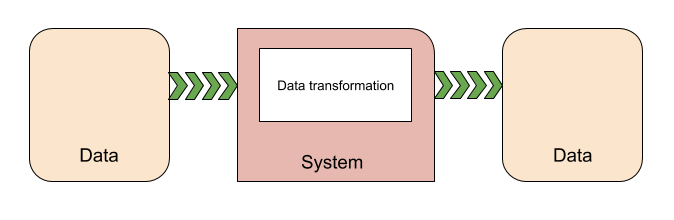

# [Systems](https://docs.unity3d.com/Packages/com.unity.entities@0.11/manual/ecs_systems.html)
**System**，即ECS中的S，提供了将组件数据从其当前状态转换为下一个状态的逻辑-例如，系统可能会通过其速度乘以自上次更新以来的时间间隔来更新所有移动实体的位置 。  

## Instantiating systems
Unity ECS自动在您的项目中发现系统类，并在运行时实例化它们。 它将每个发现的系统添加到默认系统组之一。 您可以使用[系统属性](https://docs.unity3d.com/Packages/com.unity.entities@0.11/manual/system_update_order.html#attributes)来指定系统的父组以及该系统在该组中的顺序。 如果您未指定父项，则Unity将以确定性但未指定的顺序将系统添加到默认世界的Simulation系统组中。 您也可以使用属性禁用自动创建。

系统的更新循环由其父组件[ComponentSystemGroup](https://docs.unity3d.com/Packages/com.unity.entities@0.11/manual/system_update_order.html)驱动。 ComponentSystemGroup本身是一种特殊的系统，负责更新其子系统。 组可以嵌套。 系统从运行的[世界](https://docs.unity3d.com/Packages/com.unity.entities@0.11/api/Unity.Entities.World.html)中获取时间数据； 时间由[UpdateWorldTimeSystem](https://docs.unity3d.com/Packages/com.unity.entities@0.11/api/Unity.Entities.UpdateWorldTimeSystem.html)更新。

您可以使用**Entity Debugger**窗口（菜单：**Window > Analysis > Entity Debugger**）查看系统配置。

## System types
Unity ECS提供了几种类型的系统。 通常，为实现游戏行为和数据转换而编写的系统将扩展[SystemBase](https://docs.unity3d.com/Packages/com.unity.entities@0.11/api/Unity.Entities.SystemBase.html)。 其他系统类具有特殊目的。 通常，您使用[EntityCommandBufferSystem](https://docs.unity3d.com/Packages/com.unity.entities@0.11/manual/entity_command_buffer.html)和[ComponentSystemGroup](https://docs.unity3d.com/Packages/com.unity.entities@0.11/manual/system_update_order.html)类的现有实例。
* [SystemBase](https://docs.unity3d.com/Packages/com.unity.entities@0.11/api/Unity.Entities.SystemBase.html) -- 创建系统时要实现的基类。
* [EntityCommandBufferSystem](https://docs.unity3d.com/Packages/com.unity.entities@0.11/manual/entity_command_buffer.html) -- 为其他系统提供[EntityCommandBuffer](https://docs.unity3d.com/Packages/com.unity.entities@0.11/api/Unity.Entities.EntityCommandBuffer.html)实例。 每个默认系统组在其子系统列表的开头和结尾都维护一个**Entity Command Buffer System**。 这使您可以对结构更改进行分组，以使它们在框架中产生更少的[同步点](https://docs.unity3d.com/Packages/com.unity.entities@0.11/manual/sync_points.html)。
* [ComponentSystemGroup](https://docs.unity3d.com/Packages/com.unity.entities@0.11/manual/system_update_order.html) -- 提供其他系统的嵌套组织和更新顺序。 默认情况下，Unity ECS创建多个组件系统组。
* [GameObjectConversionSystem](https://docs.unity3d.com/Packages/com.unity.entities@0.11/manual/gp_overview.html) -- 将游戏的基于GameObject的编辑器内表示转换为高效的基于实体的运行时表示。 游戏转换系统在Unity编辑器中运行。

**重要说明**：[ComponentSystem](https://docs.unity3d.com/Packages/com.unity.entities@0.5/manual/entity_iteration_foreach.html)和[JobComponentSystem](https://docs.unity3d.com/Packages/com.unity.entities@0.5/manual/entities_job_foreach.html)类以及[IJobForEach](https://docs.unity3d.com/Packages/com.unity.entities@0.5/manual/entity_iteration_job.html)已从DOTS API中逐步淘汰，但尚未正式弃用。 请改用SystemBase和Entities.ForEach。